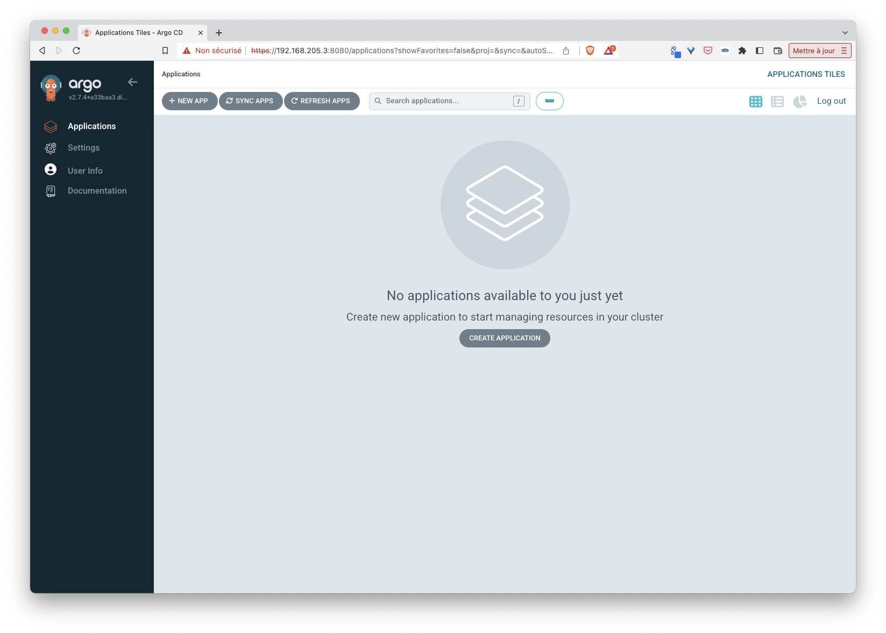
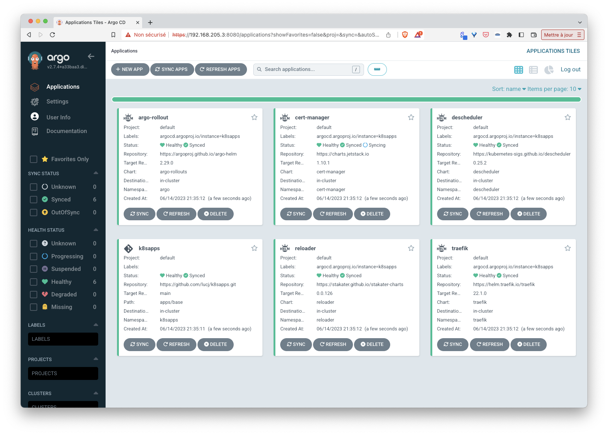
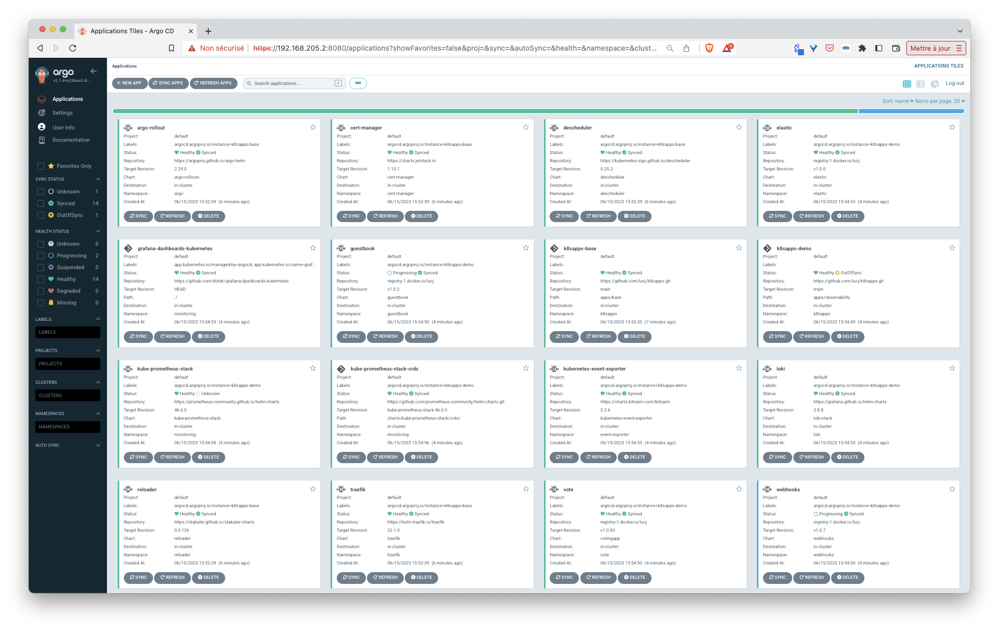

## Purpose

This repo is mainly used for demo purposes to illustrate the *App of Apps* pattern where a single Argo CD's application is used to deploy all the other applications needed in the cluster.

## Local Kubernetes

To test things locally, we will create a one-node Kubernetes using [Multipass](https://multipass.run), a great tool (available on MacOS, Windows and Linux) to spin up Ubuntu VM in a breeze. 

First we create a VM named kube:

```
multipass launch -n kube -c 4 -d 20G -m 6G
```

Note: we use specific flags to give the VM more resources than the default ones (1 cpu, 1G RAM, 5G Disk) to make sure we have enough resources to install several applications. If your local machine does not have that much resources, feel free to change these settings a bit.

Next we run a shell in that VM:

```
multipass shell kube
```

Next we install [k3s](https://k3s.io) inside of it (making sure to remove Traefik Ingress Controller as we will use Argo CD to deploy it in the next step)

```
curl -sfL https://get.k3s.io | sh -s - --disable traefik
```

Next we configure kubectl to it uses the kubeconfig file created by k3s:

```
mkdir -p $HOME/.kube
sudo mv -i /etc/rancher/k3s/k3s.yaml $HOME/.kube/config
sudo chown $(id -u):$(id -g) $HOME/.kube/config
```

Then we make sure we have access to the cluster:

```
$ kubectl get node
NAME   STATUS   ROLES                  AGE   VERSION
kube   Ready    control-plane,master   25s   v1.26.5+k3s1
```

## A couple of prerequisites

Install the following components on your local machine:

- Helm
- helm-diff
- Helmfile

On a Linux or MacOS machine the installation can be done with the following command:

```sh
OS=linux     # change to match your current os (linux / darwin)
ARCH=arm64   # change to match your current architecture (amd64 / arm64)

# Helm
HELM_VERSION=v3.12.1
curl -sSLO https://get.helm.sh/helm-${HELM_VERSION}-$OS-$ARCH.tar.gz
tar zxvf helm-${HELM_VERSION}-$OS-$ARCH.tar.gz
sudo mv ./$OS-$ARCH/helm /usr/local/bin

# Helm-diff
HELM_DIFF_VERSION="3.8.1"
helm plugin install https://github.com/databus23/helm-diff --version ${HELM_DIFF_VERSION}

# Helmfile
HELMFILE_VERSION=0.154.0
curl -sSLO https://github.com/helmfile/helmfile/releases/download/v${HELMFILE_VERSION}/helmfile_${HELMFILE_VERSION}_${OS}_$ARCH.tar.gz
tar zxvf helmfile_${HELMFILE_VERSION}_${OS}_$ARCH.tar.gz
sudo mv ./helmfile /usr/local/bin/
```

Note: Helmfile is a very handy tool which allows to use specify Helm charts in a declarative way

## ArgoCD installation

Below are 2 possibilities to install Argo CD:

- using Helm

```
helm repo add argo https://argoproj.github.io/argo-helm

helm install argocd argo/argo-cd --version 5.36.1 -n argocd --create-namespace
```

- using Helmfile

The following command installs Argo CD using Helmfile:

```
cat <<EOF | helmfile apply -f -
repositories:
  - name: argo
    url: https://argoproj.github.io/argo-helm

releases:
  - name: argocd
    namespace: argocd
    labels:
      app: argocd
    chart: argo/argo-cd
    version: ~5.36.1
EOF
```

Note: if you need to install Argo CD with a helmfile plugin and sops/age key please check [INSTALLATION.md](./INSTALLATION.md)

## Argo CD dashboard

Now Argo CD is installed, we can access its "really neat" web UI.

First we retrieve the admin password (this can take a few seconds before it is available):

```
kubectl -n argocd get secret argocd-initial-admin-secret -o jsonpath="{.data.password}" | base64 --decode
```

Next we expose the UI with a port-forward

```
kubectl -n argocd port-forward service/argocd-server 8080:443 --address 0.0.0.0
```

Then we run a browser using the IP address of the VM created above (this one can be retreived with the command ```multipass info kube```) and port 8080. We use the *admin* username and the *password* retrieved abvove to login.  



There are currently no application as we haven't created any yet.

## Running sample applications

Argo CD is up and running we can now use it to deploy applications in our cluster.

In this first example, we will use Argo CD to deploy the following apps:
- *Traefik*
- *Argo Rollout*
- *Descheduler*
- *Cert-Manager*
- *Reloader*

To do so, we need to tell Argo CD:
- where it can find the specification of the applications to deploy
- where we want it to deploy those apps

The file *apps/base.yaml* defines an Argo CD application named *k8sapps-base* which is an umbrella app above all the application defined in *https://github.com/lucj/k8sapps/tree/main/apps/base* (*source* key) in the current cluster (*destination* key). In short: creating the k8sapps-base application will automatically deploy the applications underneath. 

*apps/base.yaml*:
```
apiVersion: argoproj.io/v1alpha1
kind: Application
metadata:
  name: k8sapps-base
  namespace: argocd
  finalizers:
    - resources-finalizer.argocd.argoproj.io
spec:
  project: default
  source:
    repoURL: https://github.com/lucj/k8sapps.git
    targetRevision: main
    path: apps/base
  destination:
    server: https://kubernetes.default.svc
    namespace: k8sapps
  syncPolicy:
    automated: {}
    syncOptions:
      - CreateNamespace=true
```

From another terminal, run the following:

```
kubectl apply -f https://raw.githubusercontent.com/lucj/k8sapps/main/apps/base.yaml
```

From the Argo CD UI we can see that the creation of the above application automatically triggers the creation of the other applications that are defined in the apps folder (traefik, cert-manager, ...).



Note: each time we will define another Application within the apps/base git folder, Argo CD will notice it and automatically deploy it

On top of *base* applications, additional apps are defined and grouped in different categories such as *observability*, *security* or *demo* under the *apps* folder. Creating both *demo.yaml* and *observability.yaml* applications we can see all the applications belonging to those category are deployed by Argo CD as well.

```
kubectl apply -f https://raw.githubusercontent.com/lucj/k8sapps/main/apps/demo.yaml

kubectl apply -f https://raw.githubusercontent.com/lucj/k8sapps/main/apps/observability.yaml
```



Want to add / remove an application from your cluster ? Just add / remove its specification in the corresponding Git repo and leave Argo CD do the rest ! :)

## Status

This is a work in progress. This repo is dedicated to demo purposes only.

## License

MIT License

Copyright (c) [2023]

Permission is hereby granted, free of charge, to any person obtaining a copy
of this software and associated documentation files (the "Software"), to deal
in the Software without restriction, including without limitation the rights
to use, copy, modify, merge, publish, distribute, sublicense, and/or sell
copies of the Software, and to permit persons to whom the Software is
furnished to do so, subject to the following conditions:

The above copyright notice and this permission notice shall be included in all
copies or substantial portions of the Software.

THE SOFTWARE IS PROVIDED "AS IS", WITHOUT WARRANTY OF ANY KIND, EXPRESS OR
IMPLIED, INCLUDING BUT NOT LIMITED TO THE WARRANTIES OF MERCHANTABILITY,
FITNESS FOR A PARTICULAR PURPOSE AND NONINFRINGEMENT. IN NO EVENT SHALL THE
AUTHORS OR COPYRIGHT HOLDERS BE LIABLE FOR ANY CLAIM, DAMAGES OR OTHER
LIABILITY, WHETHER IN AN ACTION OF CONTRACT, TORT OR OTHERWISE, ARISING FROM,
OUT OF OR IN CONNECTION WITH THE SOFTWARE OR THE USE OR OTHER DEALINGS IN THE
SOFTWARE.
