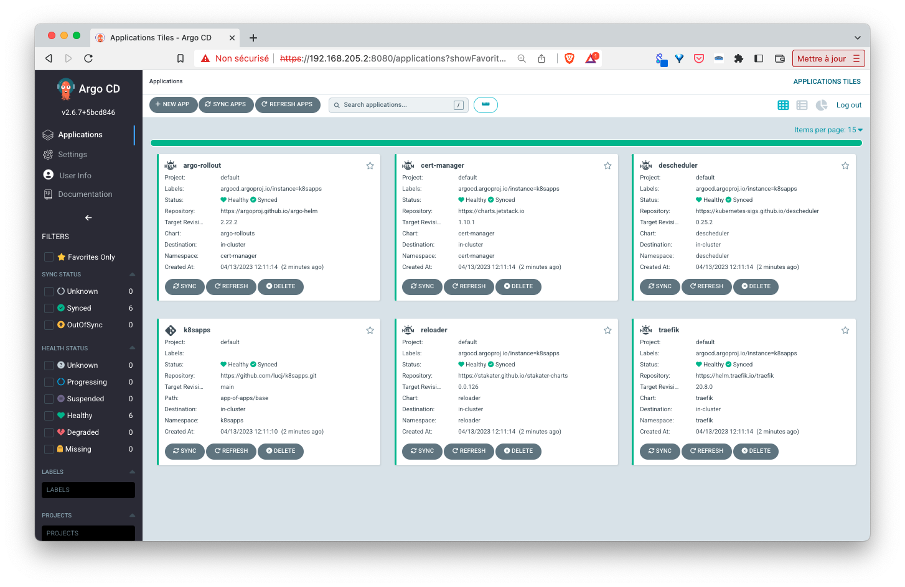

## Purpose

This repo contains a couple of applications (more to be added) defined either as:
- a list of yaml manifests
- a Helm chart

It is mainly used for demo purposes to illustrate the *App of Apps* pattern: a single Argo CD's application is used to deploy all the other applications needed in the cluster.

## Local Kubernetes

To create a local Kubernetes one-node cluster you can use [Multipass](https://multipass.run), it's a great tool (available on MacOS, Windows and Linux) to spin up Ubuntu VM in a breeze. 

First we create a VM named kube:

```
multipass launch -n kube -c 4 -d 20G -m 6G
```

Note: we use specific flags to give the VM more resources than the default ones (1 cpu, 1G RAM, 5G Disk) so we have enough to install several applications

Next we run a shell in that VM:

```
multipass shell kube
```

Next we install [k3s](https://k3s.io) inside of it:

```
curl -sfL https://get.k3s.io | sh -s - --disable traefik
```

Note: we removed the traefik installation as it will be done in the next step

Next we configure kubectl to it uses the kubeconfig file created by k3s:

```
mkdir -p $HOME/.kube
sudo mv -i /etc/rancher/k3s/k3s.yaml $HOME/.kube/config
sudo chown $(id -u):$(id -g) $HOME/.kube/config
```

Then we make sure we have access to the cluster:

```
$ kubectl get node
NAME   STATUS   ROLES                  AGE   VERSION
kube   Ready    control-plane,master   25s   v1.25.4+k3s1
```

## A couple of prerequisites

Install the following components in your newly created cluster:
- Helm
- helm-diff
- Helmfile ([https://github.com/helmfile/helmfile#installation](https://github.com/helmfile/helmfile#installation))

On a Linux or MacOS machine the installation can be done with the following command:

```sh
OS=linux     # change to match your current os (linux / darwin)
ARCH=amd64   # change to match your current architecture (amd64 / arm64)

# Helm
HELM_VERSION=v3.11.1
curl -sSLO https://get.helm.sh/helm-${HELM_VERSION}-$OS-$ARCH.tar.gz
tar zxvf helm-${HELM_VERSION}-$OS-$ARCH.tar.gz
sudo mv ./$OS-$ARCH/helm /usr/local/bin

# Helm-diff
helm plugin install https://github.com/databus23/helm-diff

# Helmfile
HELMFILE_VERSION=0.152.0
curl -sSLO https://github.com/helmfile/helmfile/releases/download/v${HELMFILE_VERSION}/helmfile_${HELMFILE_VERSION}_${OS}_$ARCH.tar.gz
tar zxvf helmfile_${HELMFILE_VERSION}_${OS}_$ARCH.tar.gz
sudo mv ./helmfile /usr/local/bin/
```

## ArgoCD installation

The following command installs Argo CD using Helmfile:

```
helmfile apply
```

## Example

Once Argo CD is installed you can run the following command which creates an Argo CD application in charge of deploying other applications defined in the *app-of-apps/base* folder:

```
cat <<EOF | kubectl apply -f -
apiVersion: argoproj.io/v1alpha1
kind: Application
metadata:
  name: k8sapps
  namespace: argocd
  finalizers:
    - resources-finalizer.argocd.argoproj.io
spec:
  project: default
  source:
    repoURL: https://github.com/lucj/k8sapps.git
    targetRevision: main
    path: app-of-apps/base
  destination:
    server: https://kubernetes.default.svc
    namespace: k8sapps
  syncPolicy:
    automated: {}
    syncOptions:
      - CreateNamespace=true
EOF
```

## Argo CD dashboard

Let's now access Argo CD's web frontend:

- first we retrieve the admin password

```
kubectl -n argocd get secret argocd-initial-admin-secret -o jsonpath="{.data.password}" | base64 --decode
```

- next we expose the UI with a port-forward

```
kubectl -n argocd port-forward service/argocd-server 8080:443 --address 0.0.0.0
```

- then we can access the UI using the IP address of the VM created above

From the Argo CD UI we can see that the creation of the above application automatically triggers the creation of the other applications that are defined in the apps folder (traefik, cert-manager, ...).



From the command line, we can check all the running Pods:

```
ubuntu@kube:~$ k get po -A
NAMESPACE      NAME                                                       READY   STATUS      RESTARTS      AGE
kube-system    local-path-provisioner-79f67d76f8-vp26w                    1/1     Running     0             22m
kube-system    coredns-597584b69b-lmp9q                                   1/1     Running     0             22m
kube-system    metrics-server-5c8978b444-96mjm                            1/1     Running     0             22m
argocd         argocd-redis-85f9f97497-hmznh                              1/1     Running     0             19m
argocd         argocd-applicationset-controller-56cbf68974-4ddgc          1/1     Running     0             19m
argocd         argocd-notifications-controller-6cd7579cf6-9j8j6           1/1     Running     0             19m
argocd         argocd-dex-server-c449468df-c4q9n                          1/1     Running     0             19m
argocd         argocd-application-controller-0                            1/1     Running     0             19m
argocd         argocd-server-8689f4bd94-fpcbt                             1/1     Running     0             19m
argocd         argocd-repo-server-5c64f98dbf-cdnsw                        2/2     Running     0             19m
kube-system    svclb-traefik-53628852-mvfwk                               2/2     Running     0             19m
acorn-system   acorn-controller-75b5467b7c-l77sn                          1/1     Running     0             19m
acorn-system   acorn-api-575b9b85bb-54dxx                                 1/1     Running     0             19m
reloader       reloader-reloader-646485f98d-fw4j4                         1/1     Running     0             19m
vote           worker-748bb65b86-6mgj8                                    1/1     Running     0             18m
vote           redis-5bfdfffbc7-q7b8j                                     1/1     Running     0             18m
cert-manager   cert-manager-5958fd9d8d-5t9rl                              1/1     Running     0             18m
cert-manager   cert-manager-cainjector-7999df5dbc-wm566                   1/1     Running     0             18m
vote           result-ui-b58566894-c6jln                                  1/1     Running     0             18m
traefik        traefik-84669b85b6-78hk4                                   1/1     Running     0             19m
vote           vote-ui-77b64c6788-sm2s7                                   1/1     Running     0             18m
vote           vote-84859d9cb8-89k2w                                      1/1     Running     0             18m
vote           db-5f5db97764-bb2q2                                        1/1     Running     0             18m
vote           result-86984bcb7d-hthpc                                    1/1     Running     0             18m
cert-manager   cert-manager-webhook-7f8f79d49c-6dtwb                      1/1     Running     0             18m
monitoring     kube-prometheus-stack-prometheus-node-exporter-sjr44       1/1     Running     0             18m
monitoring     kube-prometheus-stack-operator-5897c6cc4f-jbw7h            1/1     Running     0             18m
monitoring     alertmanager-kube-prometheus-stack-alertmanager-0          2/2     Running     1 (18m ago)   18m
monitoring     kube-prometheus-stack-kube-state-metrics-b64cf5876-vhdg5   1/1     Running     0             18m
monitoring     kube-prometheus-stack-grafana-647c7fbbd7-ztvln             3/3     Running     0             18m
monitoring     prometheus-kube-prometheus-stack-prometheus-0              2/2     Running     0             18m
loki           loki-0                                                     1/1     Running     0             18m
loki           loki-promtail-rbkws                                        1/1     Running     0             18m
elastic        elasticsearch-86f48b9f9-m6jrg                              1/1     Running     0             6m8s
elastic        logstash-c887f7f47-sbwwm                                   1/1     Running     0             6m8s
elastic        kibana-5fc57bd969-88d56                                    1/1     Running     0             6m8s
descheduler    descheduler-27851550-v2dtx                                 0/1     Completed   0             4m39s
descheduler    descheduler-27851552-8zqg8                                 0/1     Completed   0             2m39s
descheduler    descheduler-27851554-89lb6                                 0/1     Completed   0             39s
```

In order to deploy / remove an application we just need to create / delete the corresponding Argo CD *Application* resource.

## Status

This is a work in progress. This repo is dedicated to demo purposes only.

## License

MIT License

Copyright (c) [2022]

Permission is hereby granted, free of charge, to any person obtaining a copy
of this software and associated documentation files (the "Software"), to deal
in the Software without restriction, including without limitation the rights
to use, copy, modify, merge, publish, distribute, sublicense, and/or sell
copies of the Software, and to permit persons to whom the Software is
furnished to do so, subject to the following conditions:

The above copyright notice and this permission notice shall be included in all
copies or substantial portions of the Software.

THE SOFTWARE IS PROVIDED "AS IS", WITHOUT WARRANTY OF ANY KIND, EXPRESS OR
IMPLIED, INCLUDING BUT NOT LIMITED TO THE WARRANTIES OF MERCHANTABILITY,
FITNESS FOR A PARTICULAR PURPOSE AND NONINFRINGEMENT. IN NO EVENT SHALL THE
AUTHORS OR COPYRIGHT HOLDERS BE LIABLE FOR ANY CLAIM, DAMAGES OR OTHER
LIABILITY, WHETHER IN AN ACTION OF CONTRACT, TORT OR OTHERWISE, ARISING FROM,
OUT OF OR IN CONNECTION WITH THE SOFTWARE OR THE USE OR OTHER DEALINGS IN THE
SOFTWARE.
